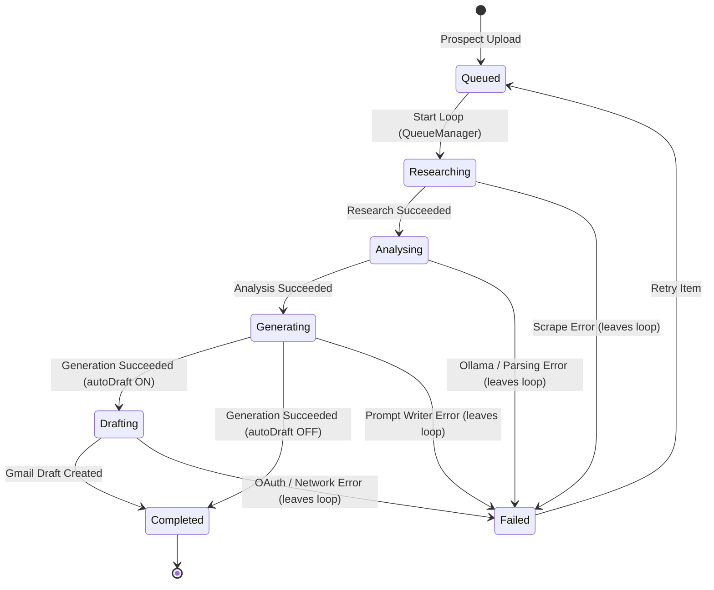
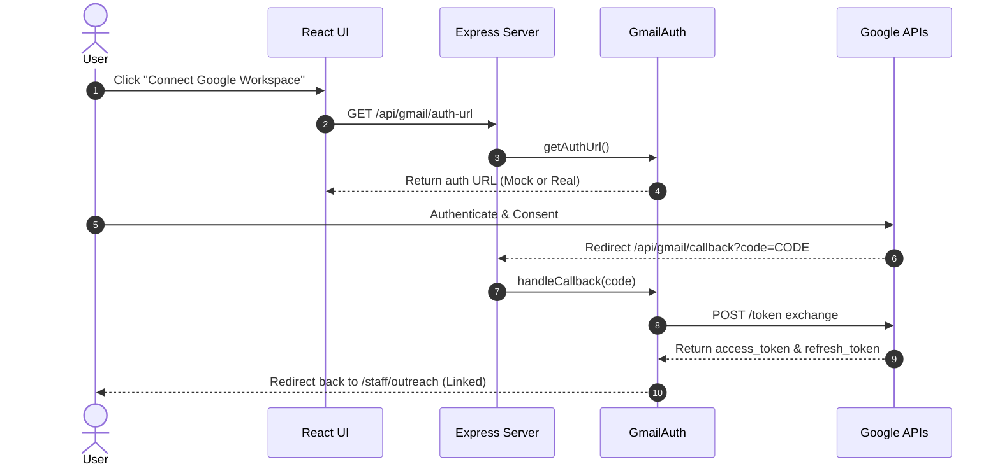
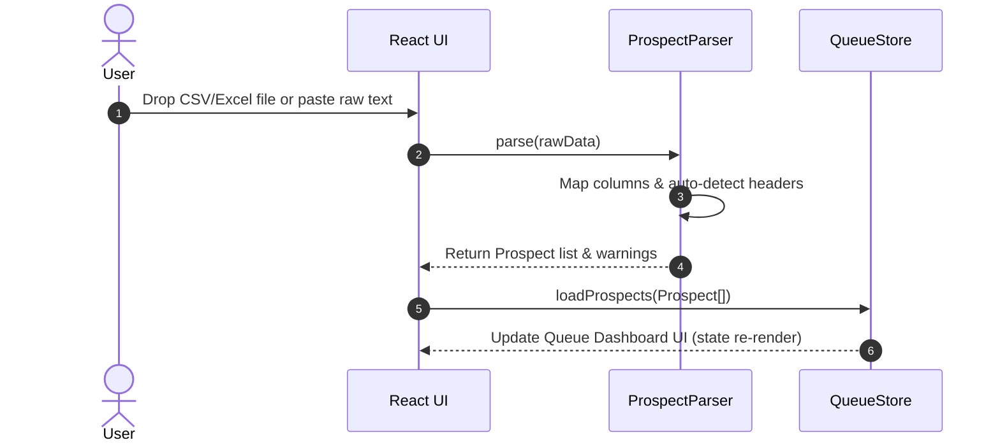
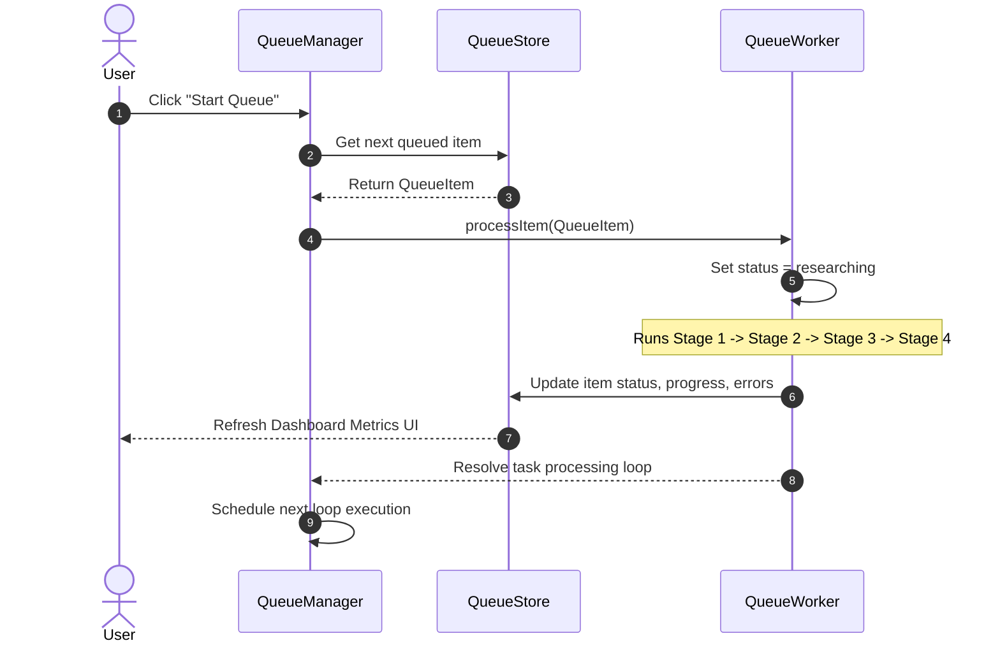
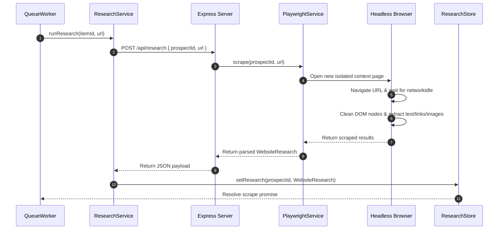
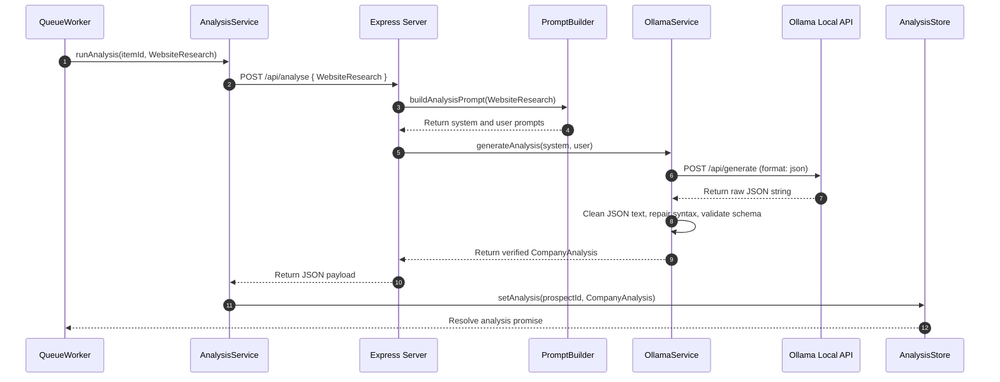
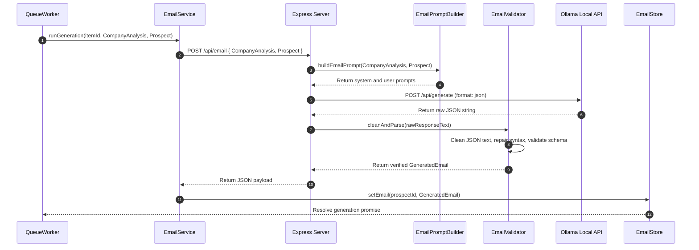
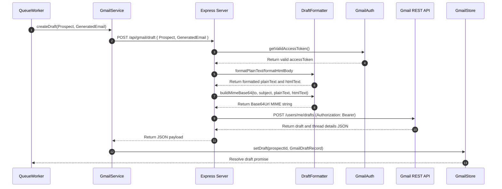
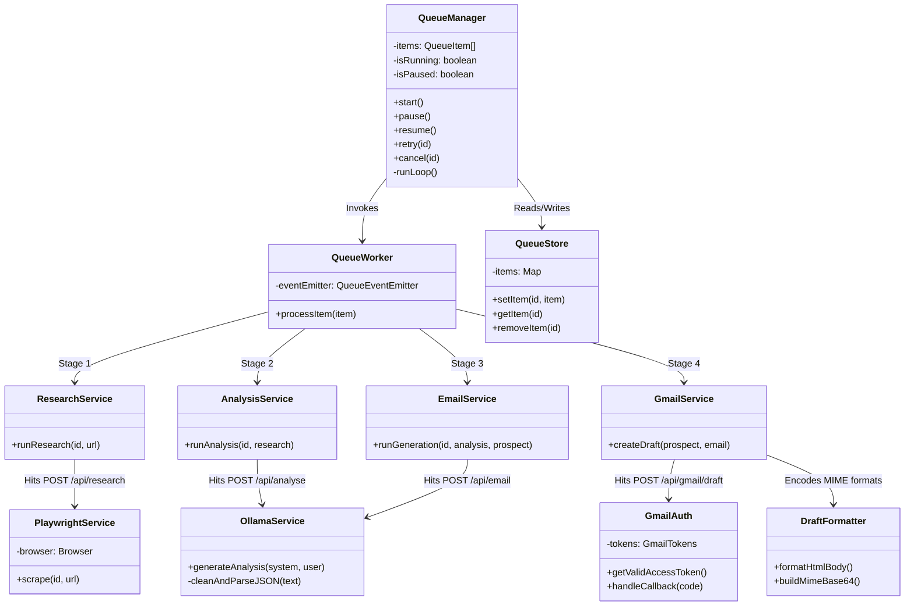

# AI Outreach Platform - Technical Architecture & Handover Report

This document serves as a complete technical reference and handover manual for the AI Outreach system. It outlines the architectural specifications, component boundaries, and pipeline mechanisms built across Sprints 1–6.

---

## 1. High-Level Architecture

Data enters the system as raw prospect lists and moves sequentially through a structured, single-threaded processing pipeline.

```mermaid
flowchart TD
    RawData[CSV/Excel/Text] -->|Upload & Map| Parsers[Prospect Parsers]
    Parsers -->|Parse & Load| QueueStore[QueueStore]
    QueueStore -->|Poll Item| QueueManager[QueueManager]
    QueueManager -->|Process| QueueWorker[QueueWorker]
    
    subgraph Pipeline Stages (Processed One-by-One)
        QueueWorker -->|Stage 1: Crawl URL| Research[Research Engine - Playwright]
        Research -->|Save Output| ResearchStore[ResearchStore]
        
        QueueWorker -->|Stage 2: Analyse Business| Analysis[AI Analysis - Ollama]
        Analysis -->|Save Output| AnalysisStore[AnalysisStore]
        
        QueueWorker -->|Stage 3: Generate Email| EmailGen[Email Generation - Ollama]
        EmailGen -->|Save Output| EmailStore[EmailStore]
        
        QueueWorker -->|Stage 4: Create Draft| GmailDraft[Gmail Draft Integration]
        GmailDraft -->|Save Output| GmailStore[GmailStore]
      
        GmailDraft -->|Automatic / Manual Mode| Completed[Completed Pipeline]
    end
```

### Stage Responsibilities & Data Movement

1. **Prospect Upload**: 
   - **Responsibility**: Accepts raw CSV, Excel (.xlsx), or tab-separated text inputs, cleans inputs, auto-identifies headers, maps columns (company, website, city, state, contacts, emails), and generates a UUID.
   - **Data Movement**: Produces an array of `Prospect` objects that are initialized into the client-side `queueStore` as `QueueItem` records with a status of `queued`.
2. **Queue Process**:
   - **Responsibility**: Manages execution state (starts, pauses, resumes, retries, cancels) and runs items sequentially.
   - **Data Movement**: The `QueueWorker` processes one `QueueItem` at a time, moving it through subsequent pipeline stages.
3. **Website Research**:
   - **Responsibility**: Visits the prospect's homepage, follows redirects, cleans DOM nodes, extracts metadata, internal links, image paths, and body text.
   - **Data Movement**: Sends the prospect UUID and URL to `/api/research`. The endpoint returns a `WebsiteResearch` object, which is saved in the in-memory client `ResearchStore`.
4. **Business Analysis**:
   - **Responsibility**: Processes the cleaned body text from the research stage to extract structured business intelligence (summary, industry, model, ICP, tech stack, pain points, and AI opportunities).
   - **Data Movement**: Passes the `WebsiteResearch` output to `/api/analyse`. The backend queries a local Ollama instance running the `qwen3:4b` model, validates the structured JSON, and returns a `CompanyAnalysis` object which is stored in `AnalysisStore`.
5. **Email Generation**:
   - **Responsibility**: Composes a short (under 250 words) cold outreach email featuring 3 custom AI opportunities tailored specifically to the prospect's business.
   - **Data Movement**: Sends the `CompanyAnalysis` to `/api/email`. The backend queries Ollama using few-shot sales copy examples, cleans/repairs formatting, and returns a `GeneratedEmail` object which is stored in `EmailStore`.
6. **Gmail Draft**:
   - **Responsibility**: Creates a draft email in the user's Gmail account (if authenticated). Never sends emails automatically.
   - **Data Movement**: Sends the `Prospect` and `GeneratedEmail` to `/api/gmail/draft`. The backend checks OAuth authentication, builds a MIME message, posts to the Google API, and returns identifiers saved in `GmailStore`.

---

## 2. Folder Structure

The following folder tree shows all files related to the AI Outreach module:

```text
c:\Users\jsnas\OneDrive\Desktop\New folder (2)\AJ-Co.-MAIN\
├── server.ts                               # Express backend entry point
├── docs/
│   └── AI_OUTREACH_ARCHITECTURE.md         # Handover & Architecture documentation (this file)
└── src/
    ├── types/
    │   └── prospect.ts                     # Prospect model interfaces & Status Enums
    ├── components/
    │   └── staff/
    │       └── QueueDashboard.tsx          # Main Outreach interface, metrics, & modal details
    ├── pages/
    │   └── staff/
    │       └── AIOutreach.tsx              # View container linking parser forms & QueueDashboard
    ├── prompts/
    │   └── analysis/
    │   │   ├── system.ts                   # Permanent consulting rules for Ollama
    │   │   └── user.ts                     # Injects WebsiteResearch context
    │   └── email/
    │       ├── schema.ts                   # Outreach JSON validation schema
    │       ├── examples.ts                 # Few-shot human-sounding SDR email templates
    │       ├── system.ts                   # Copywriter behavioral constraints
    │       ├── user.ts                     # Injects CompanyAnalysis & Prospect context
    │       └── builder.ts                  # Bundler compiling prompt configs for Ollama
    └── services/
        ├── parsing/
        │   ├── csvParser.ts                # Custom quote-aware CSV parser
        │   ├── excelParser.ts              # SheetJS Excel parser
        │   ├── pasteParser.ts              # Tab-separated paste text parser
        │   └── prospectParser.ts           # Headers mapping and validation manager
        ├── queue/
        │   ├── QueueEvents.ts              # Event listener emitter definition
        │   ├── QueueManager.ts             # Queue execution loop orchestrator
        │   ├── QueueStore.ts               # Frontend queue state store
        │   ├── QueueTypes.ts               # Queue item schema interfaces
        │   └── QueueWorker.ts              # Stage executor thread simulation
        ├── research/
        │   ├── ResearchConfig.ts           # Crawler constants and limits (30s timeouts, sizing)
        │   ├── ResearchStore.ts            # Client research data store
        │   ├── ResearchService.ts          # Fetch interface linking clients to research API
        │   ├── ResearchTypes.ts            # Web scraper outputs schema definition
        │   └── PlaywrightService.ts        # Backend browser lifecycle and DOM crawling service
        ├── analysis/
        │   ├── AnalysisConfig.ts           # Model settings (URLs, qwen3:4b, temperature, timeouts)
        │   ├── AnalysisStore.ts            # Client company analysis data store
        │   ├── AnalysisService.ts          # Fetch interface linking clients to analysis API
        │   ├── AnalysisTypes.ts            # Business intelligence schema definitions
        │   ├── PromptBuilder.ts            # Bundler compiling system/user prompts
        │   └── OllamaService.ts            # Backend request handler & JSON repair validator
        └── gmail/
            ├── GmailConfig.ts              # Google app connection settings (scopes, redirects)
            ├── GmailStore.ts               # Client drafts data store and autoDraft flags
            ├── GmailService.ts             # Fetch interface linking clients to drafts API
            ├── GmailTypes.ts               # OAuth config and draft schema definitions
            ├── GmailAuth.ts                # Backend Google authentication & session refreshes
            └── DraftFormatter.ts           # Multi-part HTML/Plain Text MIME encoder
```

---

## 3. Queue Architecture

The processing engine manages sequential task execution on the frontend client.



### Queue Elements

- **QueueStore (`QueueStore.ts`)**: In-memory client state store holding the list of `QueueItem` records. Implements change notifications to update the dashboard.
- **QueueManager (`QueueManager.ts`)**: Singleton controller managing the sequential processing loop. Iterates through queue items. Listens to play/pause actions and schedules next items.
- **QueueWorker (`QueueWorker.ts`)**: The execution class. Processes a single item, updating progress, modifying statuses, and triggering services.
- **QueueEvents (`QueueEvents.ts`)**: EventEmitter notifying listeners of state updates (`item_started`, `item_stage_changed`, `item_progress`, `item_completed`, `item_failed`).
- **QueueTypes (`QueueTypes.ts`)**: Defines structure for `QueueItem` records.

### Loop Management & Controls

- **Pause/Resume**: The manager maintains a `isPaused` flag. At the start of each stage and tick, the worker calls `await checkPaused()`, which blocks thread resolution using a promise until resume is clicked.
- **Cancellation**: Users can cancel items. The worker calls `isCancelled(itemId)` before every step. If true, it aborts execution and marks the item as failed.
- **Retry**: Re-queues a failed item by resetting its status to `queued` and dispatching a start event to the manager.
- **Progress Updates**: Tracks completion percentages. Progress updates occur during execution (Stage 1 finishes $\rightarrow$ 25%, Stage 2 $\rightarrow$ 50%, Stage 3 $\rightarrow$ 75%, Stage 4 $\rightarrow$ 100%). Sub-tick intervals update progress visually.

---

## 4. Research Engine

The system uses Playwright to scrape prospect websites on the backend.

- **Browser Lifecycle**: The `PlaywrightService` maintains a single chromium browser instance as a singleton. The browser is launched on demand and kept open.
- **Page Lifecycle**: For every scrape request, the browser creates an isolated `BrowserContext` (with standard headers to bypass bot blocks) and opens a new page. The page navigates to the target URL and waits for `networkidle`. Once scraping finishes, the context and page are closed.
- **DOM Cleaning**: Unwanted tags (`script`, `style`, `noscript`, `svg`, `iframe`, `header', `footer`, `nav`) are removed. Elements that are hidden via style computations (`display: none`, `visibility: hidden`, `opacity: 0`) are removed. Cookie banners are identified via keyword matches (`cookie`, `consent`, `gdpr`) and removed.
- **Error Handling**: SSL warnings are ignored (`ignoreHTTPSErrors: true`). Network timeouts, redirect loops, or DNS lookups trigger throws that are caught by the worker, failing only that specific prospect's research stage.

---

## 5. AI Analysis

Business intelligence is extracted by passing the scraped website text to a local Ollama instance.

- **Prompt Construction**: `PromptBuilder` combines the permanent senior business consultant role rules (`systemPrompt`) with the dynamically populated website body text (`userPrompt`).
- **Ollama Client**: `OllamaService` posts prompts to `/api/generate` using options configured in `AnalysisConfig` (low `temperature: 0.2` to minimize hallucinations).
- **JSON Validation & Repair**: 
  - Uses Ollama's `"format": "json"` mode to force JSON structure.
  - Extracts the outermost `{ ... }` block to strip markdown backticks.
  - Fixes common formatting mistakes (removes trailing commas before brackets, escapes solitary backslashes).
  - Verifies that required fields exist and assigns fallbacks for missing list fields.

---

## 6. Email Generation

The email outreach writer composes sales pitches based on the business analysis.

- **Copywriting Strategy**: Prompts instruct the AI to act as an AJ & Co. sales copywriter, keeping the email under 250 words. Few-shot examples guide the model to adopt a professional, friendly, and non-generic tone. It highlights exactly 3 business pain points and automated solutions.
- **Validation**: `EmailValidator` parses the output, verifies required email fields (subject, preview, opening, body, opportunities list, cta, signature), and wraps opportunities in object lists.
- **EmailStore**: Client-side store containing generated emails, allowing users to view them in the dashboard.

---

## 7. Gmail Integration

Creates outreach drafts directly in user Gmail accounts.



- **Authentication Lifecycle**: Uses Google OAuth 2.0. The server stores tokens in-memory. If client secrets are absent, it operates in Mock mode, returning simulated tokens for testing.
- **Token Refresh**: The server checks access token expiry before making calls. If it is within 5 minutes of expiring, it uses the refresh token to get a new access token.
- **Draft Creation**: Builds a MIME-formatted message containing plain text and HTML views. The HTML view formats opportunities with custom inline CSS styles. The MIME message is encoded to Base64Url and sent to `POST /gmail/v1/users/me/drafts`.
- **Approval Settings (ON/OFF)**:
  - **ON (Auto-create)**: The queue worker automatically calls the draft API after email generation.
  - **OFF (Manual Review)**: The worker stops after email generation, setting the status to `completed`. The user can inspect the email draft, click "Create Gmail Draft" to create it manually, or click "Regenerate" to trigger a fresh Ollama draft.

---

## 8. In-Memory Stores

The client uses in-memory stores to track and manage state.

| Store Name | Primary Key | Key Data Contained | React Subscription Pattern |
| :--- | :--- | :--- | :--- |
| **QueueStore** | Prospect UUID | `QueueItem` object, status, stage progress, logs, errors | React hooks trigger on change events emitted by the store. |
| **ResearchStore** | Prospect UUID | Scraped URL, page titles, headings, internal links, body text | React components register change listeners on mount to trigger state re-renders. |
| **AnalysisStore** | Prospect UUID | Business summary, ICP, tech stack, pain points, AI opportunities | React components register change listeners on mount to trigger state re-renders. |
| **EmailStore** | Prospect UUID | Subject line, preview, opening, email body, CTA, signature | React components register change listeners on mount to trigger state re-renders. |
| **GmailStore** | Prospect UUID | Draft ID, thread ID, creation time, status (`created`/`failed`), `autoDraft` setting | React components register change listeners on mount to trigger state re-renders. |

---

## 9. API Endpoints

| Method | Route | Purpose | Input Payload | Output Payload | Error Behavior |
| :--- | :--- | :--- | :--- | :--- | :--- |
| **POST** | `/api/research` | Scrapes target URL using Playwright | `{ prospectId, url }` | `WebsiteResearch` JSON | Throws 500 on timeout or DNS lookup failure |
| **POST** | `/api/analyse` | Evaluates website text using Ollama | `WebsiteResearch` JSON | `CompanyAnalysis` JSON | Returns 500 if Ollama is offline or schema validation fails |
| **POST** | `/api/email` | Generates outreach email using Ollama | `{ analysis, prospect }` | `GeneratedEmail` JSON | Returns 500 if Ollama is offline or copy validation fails |
| **GET** | `/api/gmail/auth-url` | Returns Google OAuth consent URL | None | `{ url }` | Returns 500 on misconfigurations |
| **GET** | `/api/gmail/callback` | Exchanges code for tokens | `code` (query param) | Redirects client | Returns 500 if token exchange fails |
| **GET** | `/api/gmail/status` | Checks Gmail authorization state | None | Connection details JSON | Returns 500 on connection errors |
| **POST** | `/api/gmail/draft` | Creates a draft in Gmail | `{ prospect, email }` | `{ draftId, threadId, createdTime }` | Returns 401 if unauthorized; returns 500 on rate limits or API errors |

---

## 10. React Components

### `AIOutreach.tsx` (Page Container)
- **Purpose**: Integrates CSV/Excel file dropzones, raw text input areas, and lists warning grids.
- **Props**: None.
- **State**: Tracks parsed prospects list, validation errors, queue running state, and paused state.
- **Subscriptions**: Subscribes to the `QueueStore` to sync running states.

### `QueueDashboard.tsx` (Outreach Dashboard)
- **Purpose**: Displays system statistics, search bars, action buttons, the live queue table, and detailed review modals.
- **Props**: `items` list, import warnings `errors` list, queue manager controls.
- **State**: Search terms, pagination, active modal selections, and copied state flags.
- **Subscriptions**: Subscribes to `ResearchStore`, `AnalysisStore`, `EmailStore`, and `GmailStore` to re-render when pipeline updates occur.

---

## 11. Prompt System

All prompt configurations are decoupled from backend services to allow fine-tuning without changing service code.

- **AI Analysis System Prompt (`src/prompts/analysis/system.ts`)**: Configures the business consultant persona, specifies the structured JSON schema, and enforces data boundaries (use "Unknown" for non-facts).
- **AI Analysis User Prompt (`src/prompts/analysis/user.ts`)**: Injects the scraped page text, title, and headings.
- **Email Generation System Prompt (`src/prompts/email/system.ts`)**: Configures the copywriter persona, enforces word limits (under 250 words), and defines natural, professional sales language guidelines.
- **Email Generation User Prompt (`src/prompts/email/user.ts`)**: Injects the `CompanyAnalysis` result and contact names.
- **Email Examples (`src/prompts/email/examples.ts`)**: Few-shot references showcasing high-quality, human-sounding outreach emails.

---

## 12. Configuration

### Research Settings (`src/services/research/ResearchConfig.ts`)
- `timeout` (30000ms): Maximum wait time for website loading.
- `maxBodySize` (50000 chars): Characters cutoff to prevent model context overload.
- `maxLinks` (50) / `maxImages` (50): Crawl boundaries for asset collection.
- `headless` (true): Launches Playwright browser in headless mode.

### AI Analysis Settings (`src/services/analysis/AnalysisConfig.ts`)
- `ollamaUrl` (`http://localhost:11434`): Connection endpoint for the local Ollama daemon.
- `modelName` (`qwen3:4b`): Target local model.
- `temperature` (0.2): Keeps outputs deterministic to reduce hallucinations.
- `maxTokens` (2048): Token limit for generation.
- `timeout` (60000ms): Timeout for model inference.

### Email Generation Settings (`src/services/email/EmailConfig.ts`)
- `ollamaUrl` (`http://localhost:11434`): Connection endpoint for the local Ollama daemon.
- `modelName` (`qwen3:4b`): Target local model.
- `temperature` (0.3): Balanced temperature for creative copywriting.
- `maxTokens` (2048): Token limit for generation.
- `timeout` (60000ms): Timeout for model inference.

---

## 13. System Dependencies

- **`playwright`**: Runs headless browser instances for website scraping.
- **`axios`**: Handles API requests to local Ollama endpoints and the Google API.
- **`xlsx` (SheetJS)**: Parses binary Excel (.xlsx) files.
- **`lucide-react`**: Renders icons across the dashboard.
- **`express`**: Powers the backend API server.

---

## 14. Current Limitations

1. **In-Memory Storage Only**: Re-running the dev server or refreshing the browser clears all stores, wiping all research and generated emails.
2. **Single-Threaded Queue**: Queue items are processed sequentially, which can slow down bulk tasks when crawling slow websites.
3. **Homepage-Only Scraping**: Playwright only crawls the homepage URL, which may miss insights on nested pages (e.g. `/about`, `/products`).
4. **No Database Persistence**: The system does not save prospects, research, or email records to a database.
5. **No CRM Sync**: Outreach leads cannot be synced to CRMs like HubSpot or Salesforce.
6. **No Reply Tracking**: The system cannot track email replies or update outreach stats.

---

## 15. Future Expansion Points

- **Database Persistence (Supabase)**: Replace in-memory stores with a relational database (e.g. PostgreSQL) to save execution histories.
- **Worker Pools**: Implement parallel processing pools to crawl multiple prospects simultaneously.
- **CRM Syncing (HubSpot/Salesforce)**: Add webhook integrations to sync leads and generated outreach emails directly to CRMs.
- **Reply Tracking & Follow-ups**: Connect to the Gmail API history endpoint to track email replies and trigger follow-up sequences.
- **LinkedIn Enrichment**: Integrate APIs to fetch prospect profiles, roles, and histories for deeper personalization.

---

## 16. Sequence Diagrams

### Prospect Upload


### Queue Execution


### Website Research


### AI Analysis


### Email Generation


### Gmail Draft Creation


---

## 17. Module Relationships

The class diagram below illustrates how core modules interact:



---

## 18. Data Models

### Prospect Interface
```typescript
export interface Prospect {
  id: string;             // Generated UUID (Sprint 1)
  company: string;        // Target Business Name
  website?: string;       // Crawl URL (Optional)
  city?: string;          // Business location context
  state?: string;         // Business location context
  contacts: string[];     // Array of target recipients names
  emails: string[];       // Array of target recipient email addresses
}
```

### QueueItem Interface
```typescript
export interface QueueItem {
  id: string;                    // Matching Prospect UUID
  prospect: Prospect;            // Lead details
  status: ProspectStatus;        // Core queue status
  currentStage: ProspectStatus;  // Current active execution stage
  progress: number;              // Current completion percentage (0 - 100)
  startedAt?: number;            // Timestamp when processing started
  finishedAt?: number;           // Timestamp when processing completed or failed
  retryCount: number;            // Counter for retry attempts
  error?: string;                // Error message logged if execution fails
}
```

### WebsiteResearch Interface
```typescript
export interface WebsiteResearch {
  prospectId: string;     // Matching Prospect UUID
  url: string;            // Original website URL
  finalUrl: string;       // Final URL after redirect follows
  title: string;          // Scraped page title
  metaDescription: string;// Scraped page meta description
  headings: string[];     // Page headings (H1 & H2 tags)
  bodyText: string;       // Cleaned, visible text (scripts & styles removed)
  internalLinks: string[];// Internal links (up to 50)
  images: {               // Scraped image elements
    src: string;
    alt: string;
  }[];
  extractedAt: string;    // ISO Date timestamp
  duration: number;       // Scrape duration in milliseconds
  httpStatus: number;     // Scrape response status
}
```

### CompanyAnalysis Interface
```typescript
export interface CompanyAnalysis {
  prospectId: string;     // Matching Prospect UUID
  companySummary: string; // Executive summary
  industry: string;       // Identified industry sector
  businessModel: string;  // Identified business model (e.g. B2B, SaaS)
  targetCustomers: string;// Ideal Customer Profile (ICP)
  products: string[];     // Key products offered
  services: string[];     // Key services offered
  technologies: string[]; // Technologies detected
  painPoints: string[];   // Key pain points identified
  aiOpportunities: {      // Recommended AI automation ideas
    title: string;
    description: string;
    estimatedImpact: string;
  }[];
  confidence: number;     // AI confidence score (0 - 100)
  generatedAt: string;    // ISO Date timestamp
  duration: number;       // AI analysis duration in milliseconds
}
```

### GeneratedEmail Interface
```typescript
export interface GeneratedEmail {
  prospectId: string;     // Matching Prospect UUID
  subject: string;        // Email subject line
  preview: string;        // Email preview text
  opening: string;        // Email opening salutation
  body: string;           // Email body copy
  opportunities: {        // Tailored business opportunities
    title: string;
    problem: string;
    solution: string;
    benefit: string;
  }[];
  cta: string;            // Call to Action
  signature: string;      // Email signature sign-off
  confidence: number;     // AI generation confidence score (0 - 100)
  generatedAt: string;    // ISO Date timestamp
  duration: number;       // Email generation duration in milliseconds
}
```

### DraftRecord Interface
```typescript
export interface GmailDraftRecord {
  prospectId: string;     // Matching Prospect UUID
  draftId?: string;       // Gmail draft ID
  threadId?: string;      // Gmail thread ID
  createdTime?: number;   // Timestamp draft was created
  status: 'pending' | 'created' | 'failed';
  lastError?: string;     // Error message logged if creation fails
}
```

---

## 19. Security Review

- **Secrets Management**: sensitive environment variables (such as `GOOGLE_CLIENT_ID` and `GOOGLE_CLIENT_SECRET`) are kept strictly on the backend Node server. They are read from the environment using `process.env`.
- **API Boundaries**: Frontend code never accesses local Ollama servers or Google REST APIs directly. All traffic is routed through our Express backend endpoints, which validate, sanitize, and format inputs before making requests.
- **Frontend/Backend Separation**: The frontend React app operates in a sandbox. It communicates with the backend server via JSON payloads, never exposing access tokens or internal API keys.
- **OAuth Security**: access tokens and refresh tokens are stored in-memory on the backend server. The frontend only receives Google redirect links and draft confirmation IDs, keeping tokens secure.
- **Input Validation**: Parsers sanitize Excel and CSV spreadsheets. Scrapers validate URLs to prevent SSRF (Server-Side Request Forgery) attacks.
- **Prompt Injection Considerations**: Website crawl text is isolated inside designated XML/content boundaries in prompt templates. This prevents scraped web text from executing commands or overriding system prompts.

---

## 20. Production Readiness Assessment

The sub-modules are evaluated on a 1-10 scale for production readiness:

- **Queue Engine: 8/10**
  - *Reason*: Robust single-threaded sequential manager with responsive pause/resume and retry controls. Fully functional but lacks multi-threaded scaling or backend queue persistence (e.g. Redis).
- **Research Crawler: 7/10**
  - *Reason*: Clean singleton browser context management and DOM cleaning. However, crawling is limited to homepages, which may miss insights on nested pages.
- **AI Analysis: 8/10**
  - *Reason*: Robust prompts, structured JSON extraction, and syntax repair. However, local Ollama execution is single-threaded, which can slow down bulk tasks.
- **Email Generation: 8/10**
  - *Reason*: Short, tailored copy with few-shot examples. Standardized and robust, but output quality depends on the local model's parameters.
- **Gmail Integration: 8/10**
  - *Reason*: Secure OAuth 2.0 flow with token refresh and HTML formatting. Solid, but tokens are stored in-memory and will be lost on server restarts.
- **State Management: 6/10**
  - *Reason*: Clean, responsive in-memory stores. However, all states are lost on page refresh since there is no backend database persistence.
- **Security: 8/10**
  - *Reason*: Secure token storage, strict API boundaries, and isolated client access. Relies on local network environments.
- **Maintainability: 9/10**
  - *Reason*: Clean, modular structure. Service classes and prompt configurations are decoupled, making the codebase easy to maintain.
- **Scalability: 4/10**
  - *Reason*: Highly constrained. Running a single local Ollama model sequentially is slow for large prospect lists. Needs worker pools and cloud scaling to handle high volumes.

---

## 21. Handover Recommendations

The following prioritized list outlines recommendations for future development:

1. **Add Database Persistence (Supabase/PostgreSQL)**
   - *Business Impact*: High. Prevents data loss when refreshing the page.
   - *Risk*: Low. Uses standard relational database operations.
2. **Implement Persistent Queue Storage (Redis/BullMQ)**
   - *Business Impact*: High. Safely recovers active queue states if the server restarts.
   - *Risk*: Medium. Requires adding Redis to the tech stack.
3. **Move OAuth Token Storage to Secure DB Columns**
   - *Business Impact*: High. Keeps users logged in across server restarts.
   - *Risk*: Low. Requires encrypting columns before saving tokens.
4. **Implement Parallel Scraper Worker Pools**
   - *Business Impact*: High. Speeds up processing of large prospect lists.
   - *Risk*: Medium. Requires handling browser instance memory limits carefully.
5. **Support Multi-Page Website Scraping**
   - *Business Impact*: High. Crawls subpages (e.g. `/about`, `/services`) for richer context.
   - *Risk*: Low. Increases page scraping times.
6. **Integrate Remote LLM API Providers (Gemini/OpenAI)**
   - *Business Impact*: High. Offers higher analysis quality and faster response times.
   - *Risk*: Low. Simple API integration.
7. **Add Lead Deduplication Checks**
   - *Business Impact*: Medium. Prevents import errors and duplicate outreach.
   - *Risk*: Low. Uses simple email/website matching rules.
8. **Add Gmail Draft Preview Window**
   - *Business Impact*: Medium. Allows users to preview HTML email layouts in-app.
   - *Risk*: Low. Uses safe iframe sandboxing.
9. **Implement LinkedIn Profile Scraping**
   - *Business Impact*: High. Enriches leads with role and profile histories.
   - *Risk*: High. Vulnerable to LinkedIn anti-bot blocks.
10. **Build a Campaign Dashboard**
    - *Business Impact*: High. Groups prospects into structured marketing sequences.
    - *Risk*: Low. Uses simple database relations.
11. **Add Email Reply Tracking Webhooks**
    - *Business Impact*: High. Tracks replies and updates outreach metrics.
    - *Risk*: Medium. Requires configuring Google Pub/Sub notifications.
12. **Enable Custom User Prompts on the Frontend**
    - *Business Impact*: Medium. Allows users to customize email styles and tones.
    - *Risk*: Low. Simple UI update.
13. **Add CSV Export for Completed Analysis Results**
    - *Business Impact*: Medium. Allows users to download leads data.
    - *Risk*: Low. Standard frontend file download helper.
14. **Configure OAuth Callback Security Audits (CSRF states)**
    - *Business Impact*: Medium. Protects users from login session hijacking.
    - *Risk*: Low. standard state verification practices.
15. **Add OAuth Disconnect / Unlink Triggers**
    - *Business Impact*: Medium. Allows users to change Google accounts.
    - *Risk*: Low. Requires deleting stored tokens.
16. **Implement Email Word Limit Validation Triggers**
    - *Business Impact*: Low. Automatically flags generated emails that exceed word limits.
    - *Risk*: Low. Simple string length checking.
17. **Support Attachment Uploads in Outreach Emails**
    - *Business Impact*: Medium. Allows attaching case studies to outreach emails.
    - *Risk*: Medium. Requires handling multipart MIME structures.
18. **Add User Management (RBAC)**
    - *Business Impact*: Medium. Restricts access to sensitive outreach tools.
    - *Risk*: Low. Standard RBAC implementation.
19. **Implement Playwright Anti-Fingerprint Strategies**
    - *Business Impact*: Medium. Prevents crawling blocks on sites behind Cloudflare.
    - *Risk*: Medium. Requires updating browser arguments.
20. **Configure CI/CD Pipelines**
    - *Business Impact*: Medium. Automates builds and deployments.
    - *Risk*: Low. Standard DevOps configuration.
